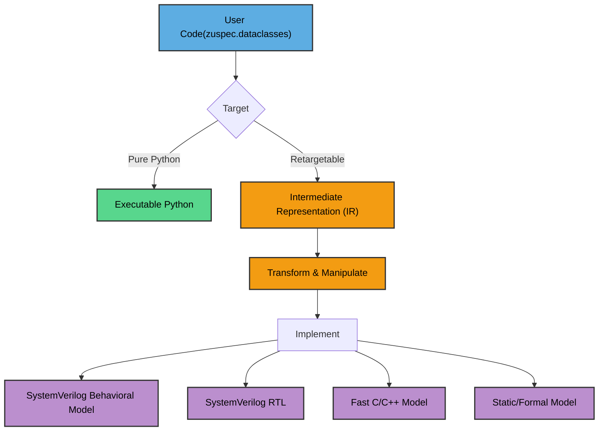

# Zuspec: A Multi-Abstraction, Multi-Platform Hardware Modeling Tool

A significant portion of the silicon design process is spent making and evaluating
models. We'd like to model the intended behavior of the design early on and 
test our assumptions by executing it and running symbolic/formal checks against it.
While the RTL designers are busy, the DV engineers would like to get a head start
on writing tests, leveraging the functional model. And, we'd like the ability to
take the programming sequences that the DV engineers have created and easily 
leverage those for emulation and once silicon comes back. 

It's possible to get some or all of these individual benefits with existing 
languages or class libraries. But, these modeling tools and techniques
are siloed, leading to significant re-work and increasing the risk of introducing
inconsistencies between the models. 

Zuspec, a portmanteau of Zusammen (*together* in German) and Specification, seeks to
unify hardware modeling under a Python-based framework. 

## Project Status
Zuspec is under active development, but not yet ready for use. Watch this 
space for updates on the project's status.

## Build Status
- **zuspec** - 
- **zuspec-dataclasses** - 
- **zuspec-be-sv** - 
- **zuspec-be-sw** - 

